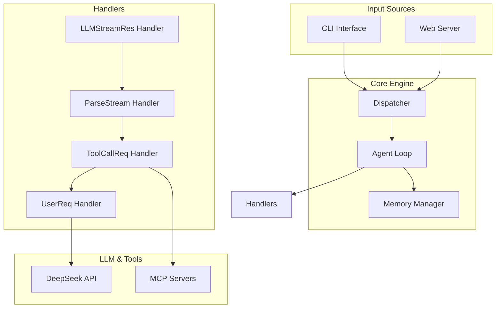

# PioClaw

Mini agent toy project with deepseek-reasoner and mcp-tools support.

## Intro

PioClaw is a lightweight agent framework built with Deno. It integrates DeepSeek Reasoner LLM and Model Context Protocol (MCP) tools, providing both CLI and web interface for interactive AI workflows.

## Features

- DeepSeek Reasoner model with streaming reasoning
- MCP tools integration (PDF tools, PowerShell, etc.)
- Event-driven message dispatcher
- Extensible callback system
- CLI and web server interfaces
- Session management with memory

## Arch



## Quick Start

### Prerequisites

- Deno 2.x
- DeepSeek API key (set as `DEEPSEEK_API_KEY` in `.env`)
- MCP configuration (optional)

### Installation

```bash
# Clone the repo
git clone https://github.com/lithiumfleet/pioclaw.git
cd pioclaw

# Set up environment
touch .env
# Edit .env with your DeepSeek API key
```

### CLI Usage

```bash
# Run example CLI agent
deno task example
```

### Web Interface (AI Generated! Buggy!)

```bash
# Start web server
deno task server
# Open http://localhost:8000
```

## How to Extend

### Using Dispatcher

The dispatcher handles different message types in the agent loop. Just add any message data type with handlers you want by editing `src/handlers/dispatcher.ts`.

```typescript
function YourNewReqDataHandler(data: {anything: any}) {
    console.log("hello from new req");
    return;
}
// register handlers here
export const dispatcher = {
  userreq: createUserReqHandler(),
  llmstreamres: createLLMResHandler(),
  toolcallreq: createToolCallHandler(),
  parsestreamreq: createParseStreamHandler(),
  YourNewReqType: YourNewReqDataHandler
};
```

### Callbacks

Register (override) custom callbacks for agent events:

```typescript
import { registerAgentCallbacks } from "@src/handlers/callbacks.ts";

registerAgentCallbacks(
  (chunk) => console.log("LLM output:", chunk),
  (reasoning) => console.log("Reasoning:", reasoning),
  (toolRes) => console.log("Tool result:", toolRes)
);
```

### Core Exports

```typescript
import { initAgent } from "@src/index.ts";
import { memoryManager, type Memory } from "@src/index.ts";
import { registerAgentCallbacks } from "@src/index.ts";

// Create agent loop
const { start, end, input } = initAgent();

// Manage memory
const memory = memoryManager().newMemory();

// Send input
input({ type: "userreq", data: { memory, prompt } });
```

## MCP Configuration

Configure MCP servers in `data/mcps.json`:

```json
{
  "servers": {
    "pdf-tools": {
      "command": "uv",
      "args": ["--directory", "PATH/TO/mcp-pdf-tools", "run", "pdf-tools"]
    }
  }
}
```

## Examples

See `example/main.ts` for CLI implementation and `server/app.ts` for web server setup.

## License

MIT
